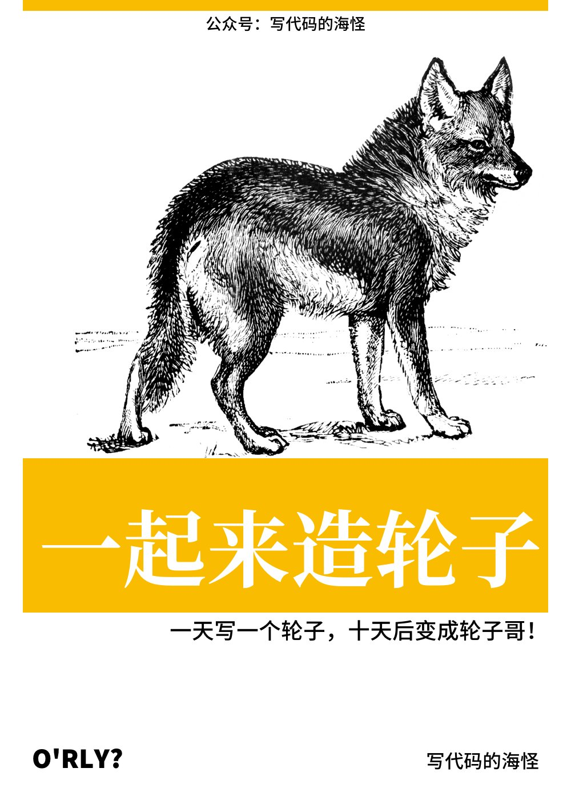
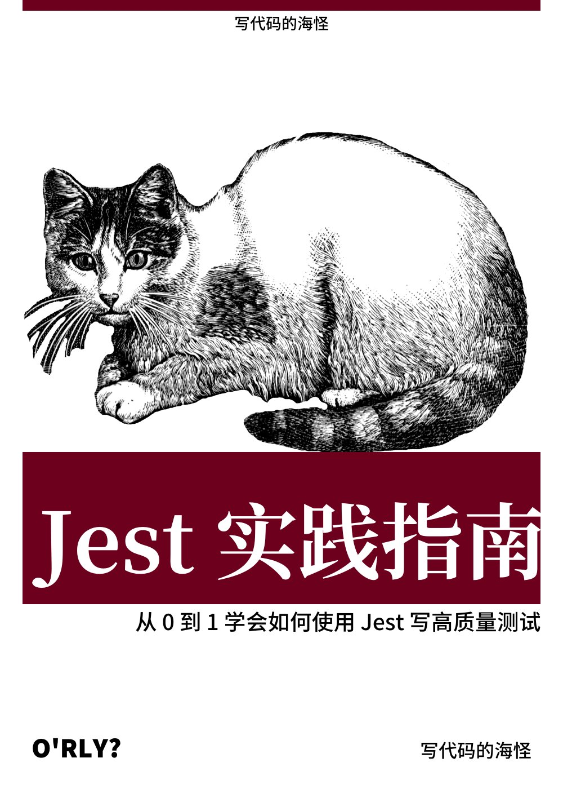
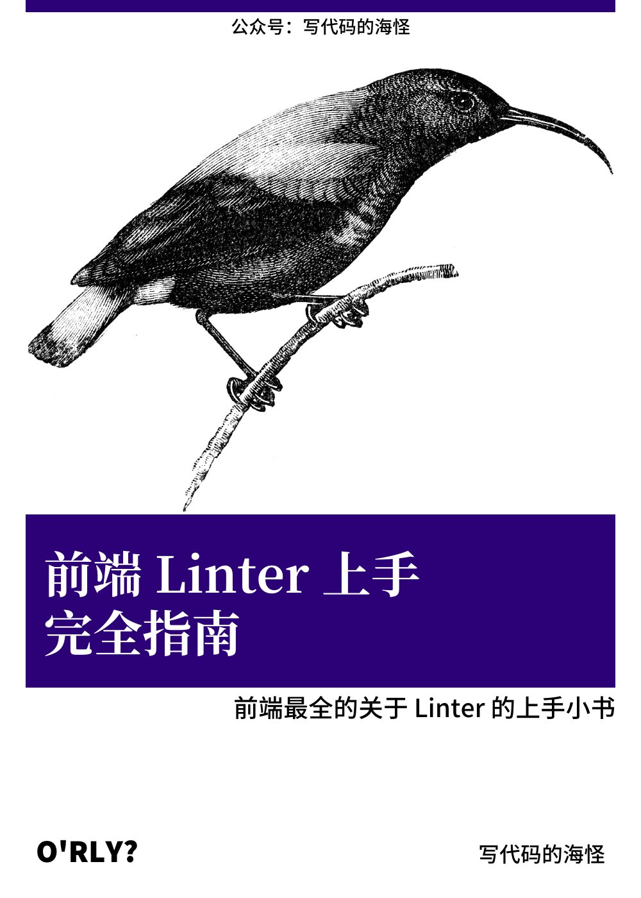
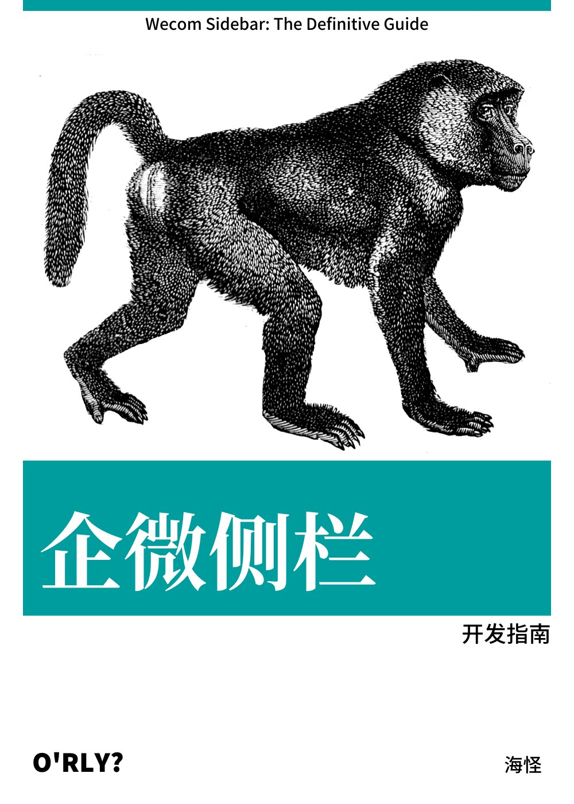
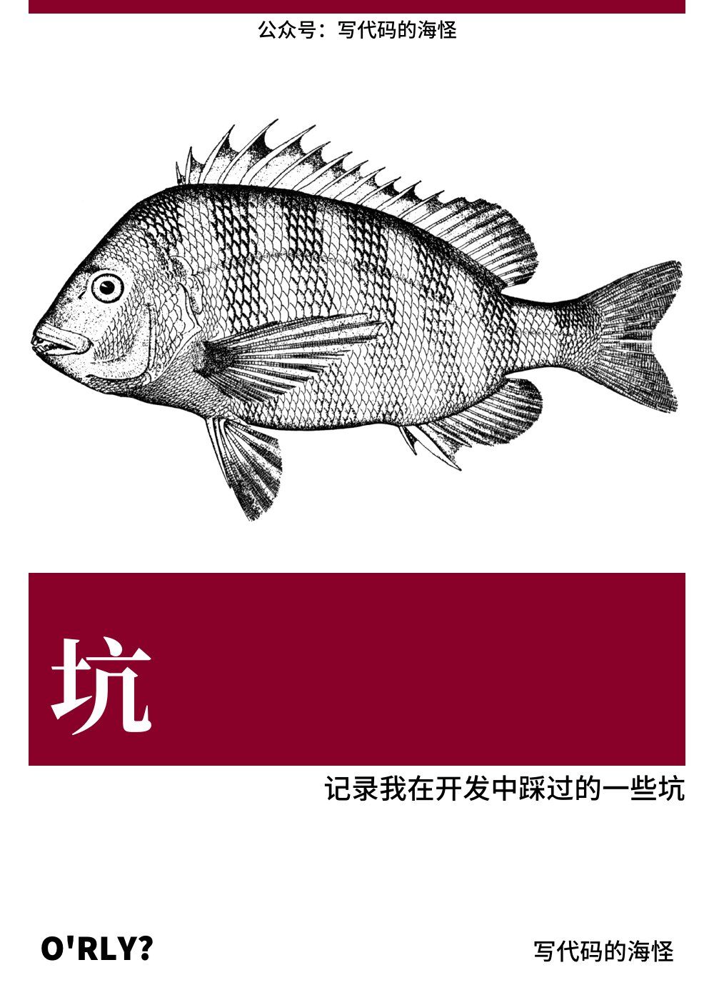

<h2>☀️ 今天</h2>
<blockquote>最后更新于 2023年06月18日 06时34分（每天早上 6:30 自动更新）</blockquote>

哈喽， 我是海怪，坐标深圳。每天分享一图：

<h2>🙌 社交</h2>

经常在各大平台出没 👻，可以搜索我的全网账号<b>【写代码的海怪】</b>找到我。每周定期更新一篇博文，关注我，一起开心写代码，快乐学编程 💪！

<table>
  <tr>
    <th><a href="#" target="_blank">公众号</a></th>
    <th><a href="https://www.zhihu.com/people/haixiangyan" target="_blank">知乎</a></th>
    <th><a href="https://juejin.cn/user/272334614432887" target="_blank">掘金</a></th>
    <th><a href="https://www.jianshu.com/u/0340be4082b5" target="_blank">简书</a></th>
    <th><a href="https://medium.com/@haixiang6123" target="_blank">Medium</a></th>
  </tr>
  <tr>
    <td>
      
    </td>
    <td>
      
    </td>
    <td>
      
    </td>
    <td>
      
    </td>
    <td>
      
    </td>
  </tr>
</table>
<h2>📚 小书</h2>

当一篇博文讲得东西非常多，或者内容非常长的时候，我就会把它变成一本在线小书。所在小书皆可免费食用 🍝、无限转载 📣，唯一要求是转载时加上【写代码的海怪】作者出处即可。

<table>
  <thead align="center">
    <tr>
      <th>封面</th>
      <th>书名</th>
      <th>简述</th>
      <th>成就</th>
    </tr>
  </thead>
  <tbody align="left">
    <tr>
      <th align="center">
        
      </th>
      <th>
        <a href="https://github.com/haixiangyan/make-wheels" target="_blank">《一起来造轮子》</a>
      </th>
      <th>前端进阶必看的造轮子小书</th>
      <th>
        
        
      </th>
    </tr>
    <tr>
      <th align="center">
        
      </th>
      <th>
        <a href="https://github.com/haixiangyan/jest-tutorial" target="_blank">《Jest 实践指南》</a>
      </th>
      <th>Jest 上手完全指南，从 0 到 1 学会前端测试的技巧、思路、策略和套路。</th>
      <th>
        
      </th>
    </tr>
    <tr>
      <th align="center">
        
      </th>
      <th>
        <a href="https://github.yanhaixiang.com/linter-tutorial/" target="_blank">《前端 Linter 上手完全指南》</a>
      </th>
      <th>前端最全的关于 Linter 的上手小书</th>
      <th>
        
      </th>
    </tr>
    <tr>
      <th align="center">
        
      </th>
      <th>
        <a href="https://wecom-sidebar.github.io/" target="_blank">《企业微信侧边栏开发指南》</a>
      </th>
      <th>企业微信侧边栏开发指南以及一系列的开发模板</th>
      <th>
        
      </th>
    </tr>
    <tr>
      <th align="center">
        
      </th>
      <th>
        <a href="https://github.com/haixiangyan/keng" target="_blank">《坑》</a>
      </th>
      <th>【连载中...】我在开发过程中遇到的坑</th>
      <th>
      </th>
    </tr>
  </tbody>
</table>
<h2>💼 项目</h2>

下面是我在学前端的路上写的一些个人项目，有的比较认真 🧐，有的只是为了好玩 🎮，有的比较沙雕 🤪。

<table>
  <thead align="center">
    <tr>
      <th>项目</th>
      <th>Github</th>
      <th>简述</th>
      <th>技术</th>
      <th>成就</th>
    </tr>
  </thead>
  <tbody align="left">
    <tr>
      <th>
        <a href="https://github.yanhaixiang.com/overwatch-ui-doc/#/" target="_blank">
        overwatch-ui</a>
      </th>
      <th>
        <a href="https://github.com/haixiangyan/overwatch-ui" target="_blank">Github</a>
      </th>
      <th>🎮 守望先锋 UI 库</th>
      <th>
        
        
      </th>
      <th>
        
        
      </th>
    </tr>
    <tr>
      <th>
        <a href="https://github.com/haixiangyan/nest-todo" target="_blank">
        nest-todo</a>
      </th>
      <th>
        <a href="https://github.com/haixiangyan/nest-todo" target="_blank">Github</a>
      </th>
      <th>🐱 一个 Nest.js 的练手项目</th>
      <th>
        
        
      </th>
      <th>
        
      </th>
    </tr>
    <tr>
      <th>
        <a href="https://chrome.google.com/webstore/detail/code-block-beautifier/gpcjjddhdnilcbddlonlfgdbejfboonn" target="_blank">
        codeblock-beautifier</a>
      </th>
      <th>
        <a href="https://github.com/haixiangyan/codeblock-beautifier" target="_blank">Github</a>
      </th>
      <th>💅 一个用于美化网页代码块的 Chrome 插件</th>
      <th>
        
        
      </th>
      <th>
        
        
        
      </th>
    </tr>
    <tr>
      <th>
        <a href="https://github.yanhaixiang.com/guitar-tabs-editor/#/" target="_blank">
        guitar-tabs-editor</a>
      </th>
      <th>
        <a href="https://github.com/haixiangyan/guitar-tabs-editor" target="_blank">Github</a>
      </th>
      <th>🎸 一个在线吉他谱编辑器</th>
      <th>
        
        
      </th>
      <th>
        
      </th>
    </tr>
    <tr>
      <th>
        <a href="https://github.yanhaixiang.com/ttplayer/" target="_blank">
        ttplayer</a>
      </th>
      <th>
        <a href="https://github.com/haixiangyan/ttplayer" target="_blank">Github</a>
      </th>
      <th>🎧 千千静听</th>
      <th>
        
      </th>
      <th>
        
      </th>
    </tr>
    <tr>
      <th>
        <a href="https://github.com/haixiangyan/me" target="_blank">
        me</a>
      </th>
      <th>
        <a href="https://github.com/haixiangyan/me" target="_blank">Github</a>
      </th>
      <th>👦 个人主页</th>
      <th>
        
        
        
      </th>
      <th>
        
      </th>
    </tr>
    <tr>
      <th>
        <a href="https://github.yanhaixiang.com/weixin-cash/" target="_blank">
        weixin-cash</a>
      </th>
      <th>
        <a href="https://github.com/haixiangyan/weixin-cash" target="_blank">Github</a>
      </th>
      <th>🧾 仿微信记账网页版</th>
      <th>
        
        
        
      </th>
      <th>
        
      </th>
    </tr>
    <tr>
      <th>
        <a href="https://github.yanhaixiang.com/sketch-book/" target="_blank">
        sketch-book</a>
      </th>
      <th>
        <a href="https://github.com/haixiangyan/sketch-book" target="_blank">Github</a>
      </th>
      <th>🎨 迷你小绘板</th>
      <th>
        
      </th>
      <th>
        
      </th>
    </tr>
    <tr>
      <th>
        <a href="https://github.yanhaixiang.com/wtf-cli" target="_blank">
        wtf-cli</a>
      </th>
      <th>
        <a href="https://github.com/haixiangyan/wtf-cli" target="_blank">Github</a>
      </th>
      <th>🖕 一个查询英文简写/缩写的命令行工具</th>
      <th>
        
      </th>
      <th>
        
      </th>
    </tr>
    <tr>
      <th>
        <a href="https://marketplace.visualstudio.com/items?itemName=HaixiangYan.tenet" target="_blank">
        tenet</a>
      </th>
      <th>
        <a href="https://github.com/haixiangyan/tenet" target="_blank">Github</a>
      </th>
      <th>🧔🏿 一个让你可以反着写代码的 VsCode 插件</th>
      <th>
        
        
      </th>
      <th>
        
        
        
      </th>
    </tr>
    <tr>
      <th>
        <a href="https://github.yanhaixiang.com/banana/" target="_blank">
        banana</a>
      </th>
      <th>
        <a href="https://github.com/haixiangyan/banana" target="_blank">Github</a>
      </th>
      <th>🍌 一只可爱的香蕉</th>
      <th>
        
      </th>
      <th>
      </th>
    </tr>
  </tbody>
</table>